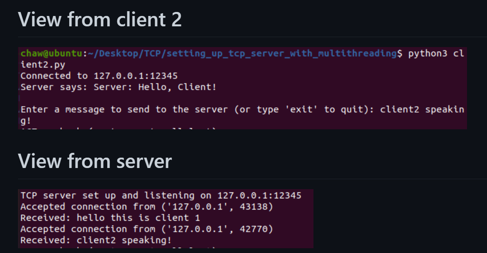

# Features
The key difference from simple TCP server is that in this server for each accepted client connection, a new thread (client_handler) is created to handle that specific client's communication. This allows the server to handle multiple clients simultaneously.

With this modification, each client that connects to the server will be processed in a separate thread, allowing for concurrent communication.

## 👉 Check out the project on My GitHub: 
[Socket programming using TCP](https://github.com/chaw-thiri/Computer-Network/tree/main/TCP/setting_up_tcp_server_with_multithreading)

